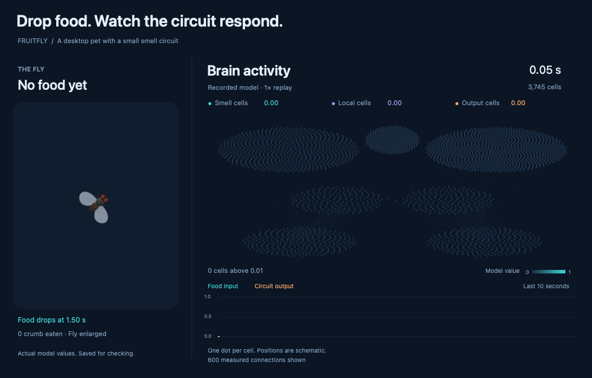
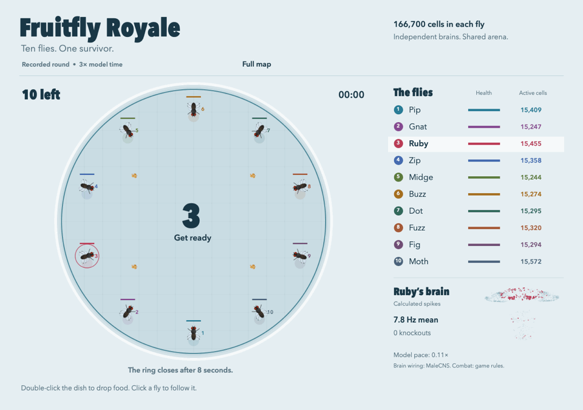
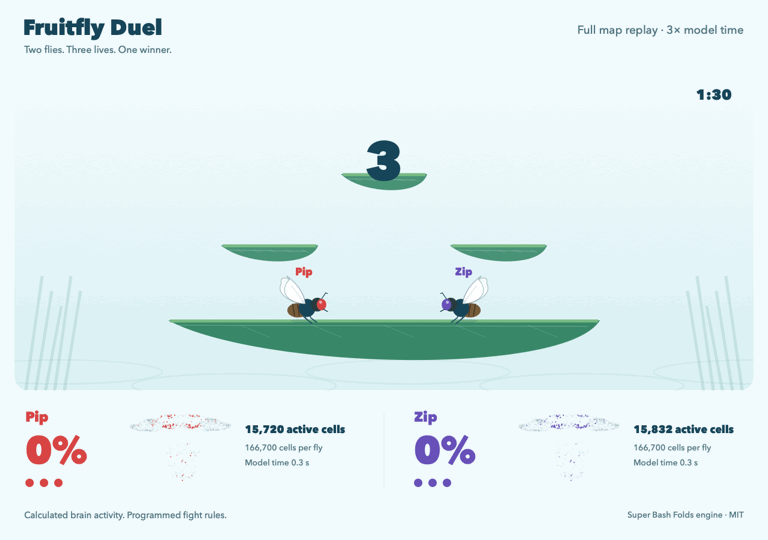

# Fruitfly

A small pet fly for your Mac desktop.

The fly moves above your apps. Drop food and watch it land and eat.
Move the pointer quickly near the fly to make it move away.

**[Download the desktop pet](https://github.com/onequbitaway/fruitfly/releases/latest)** · **[Download the full-map preview](https://github.com/onequbitaway/fruitfly/releases/tag/full-map-preview-0.1.1)**

| Download | What you get |
| --- | --- |
| Desktop pet | The small smell circuit, with a fly above your apps. |
| Full-map preview | A separate window with Simple and Full map modes. Both data sets are included. |

All app, model, and animation code is public. [Build the full-map preview from source.](experiments/full-map/README.md)


The desktop clip uses a staged scene and the full-map model. Movement follows pet rules.
[Download the desktop and brain video for sharing.](https://github.com/onequbitaway/fruitfly/releases/download/full-map-preview-0.1.0/fruitfly-desktop-and-brain.mp4)

## Watch the brain models

These clips show recorded model runs at normal speed.
The activity comes from the calculations. It is not measured in a living fly.

### Simple · current app

**3,745 cells · 435,997 connections**



Each dot shows one cell's model value. Dot positions form a diagram.
Food search and eating follow pet rules.
[Read the guide and check the saved values.](docs/activity.md)

### Full map · experimental preview

**166,700 cells · 25,582,938 connections**


The view uses published cell-body positions. Brightness follows calculated spikes.
The network includes the brain and nerve cord. Cells without positions still take part in the model.
Movement toward food remains guided. Food use reads the MN9 feeding output.

This is an experimental model of the mapped network, not a complete working fly.
**The full-map preview is now available as a separate download.**
Its window includes both modes. [Get the app or build the source.](experiments/full-map/README.md)
[Read the model notes and check the saved values.](docs/full-map-preview.md)

## Fruitfly Royale

Ten flies start in a ring. Drop food to draw them together. Watch them fight
as the ring closes. The last fly wins. Blood effects can be turned off.



Each fly has a separate brain state. Choose Simple or Full map.
The brain activity comes from calculations. Combat, blood, health, and
movement follow game rules. This Full map replay runs at three times model time.

**[Download Fruitfly Royale](https://github.com/onequbitaway/fruitfly/releases/tag/royale-0.1.0)**
or run `make royale` from this repository.
[See controls, source, and model limits.](experiments/royale/README.md)

## Fruitfly Duel

Two flies fight on a leaf stage. Watch double jumps, shields, throws,
and ring-outs. Each fly starts with three lives.



Choose Simple or Full map. Each fly has a separate brain state. Calculated
activity affects movement and attack timing. Fight rules come from the
MIT-licensed [Super Bash Folds](https://github.com/blancmathis/Super_Bash_Folds)
engine. The flies have not learned how to fight.
This Full map replay runs at three times model time.

**[Download Fruitfly Duel](https://github.com/onequbitaway/fruitfly/releases/tag/duel-0.1.0)**
or run `make duel` from this repository.
[See controls, source, and model limits.](experiments/duel/README.md)

## Install

These steps install the desktop pet. For the two-mode preview, use [its setup guide](experiments/full-map/README.md).

1. Open the download page.
2. Download the file that ends in `macos-universal.zip`.
3. Open the ZIP file.
4. Move Fruitfly to Applications.
5. Open Fruitfly.

The fly appears on your desktop. Click the fly icon in the menu bar for controls.

This early release does not yet have Apple approval through notarization.
If macOS blocks the app, open **System Settings → Privacy & Security**.
Use **Open Anyway** if you trust this download.
See [Apple's instructions](https://support.apple.com/en-us/102445) for more help.

## Requirements

- macOS 14 or later.
- An Apple Silicon or Intel Mac.

Windows and Linux are not supported.
The app runs without an account, Python, or a separate data download.

## Feed your fly

1. Click the fly icon in the menu bar.
2. Click **Place food**.
3. Click a location on your desktop.

Press Esc to cancel. Food placement also stops after 15 seconds.

You can also hold **Option** and double-click to drop food.
This shortcut also sends the click to the app below. Use **Place food** to capture one click instead.

Normal clicks pass through the fly to your other apps.

## Controls

| Control | Result |
| --- | --- |
| Place food | Select a location for a crumb. |
| Fly size | Make the fly smaller or larger. |
| Show brain activity | Open a live view of all 3,745 included cells. |
| Pause / Resume | Stop or continue the fly and food. |
| Hide fly / Show fly | Hide or show the fly and its food. |
| Bring fly here | Move the fly to the center of the current screen. |
| Clear food | Remove all crumbs. |
| Quit | Close the app. |

The fly stays on one screen. Use **Bring fly here** to move it to another screen.
The app limits food to 12 crumbs. Uneaten crumbs expire after three minutes of active use.
The app stops while the screen sleeps. It uses slower movement when Reduce Motion is on.

## Watch the activity

1. Click the fly icon in the menu bar.
2. Turn on **Show brain activity**.
3. Click **Drop food nearby** in the new window.

Dots get brighter as their model values rise.
The chart shows food input and circuit output over the last ten seconds.
Click **Pause** to hold the fly and the values. Click **Resume** to continue.

Dot positions are a diagram. They do not show the cells' positions in a real brain.
The lines show 600 selected connections from the included data.
Read [the activity guide](docs/activity.md) for the scale and recording checks.

## Build and start the app

1. Install the Apple build tools:

   ```sh
   xcode-select --install
   ```

2. Download the source:

   ```sh
   git clone https://github.com/onequbitaway/fruitfly.git
   cd fruitfly
   ```

3. Build and start the app:

   ```sh
   make run
   ```

The build creates `dist/Fruitfly.app`. You can move this file to Applications.
Run `make test` to check the movement and included data.
Run `make release` to build one app for both Mac types.

Run `make preview` to download the checked data pack and build the full-map preview.
Run `make preview-test` to check its model. See [the full-map source guide](experiments/full-map/README.md).

## Brain map

The app includes a small smell circuit from the [MaleCNS brain map](https://male-cns.janelia.org/).
It contains 3,745 cells and 435,997 connections.
The map records connections between nerve cells.

The model uses those connections to change the fly's speed and turns.
Food search, rest, eating, and pointer reactions use programmed rules.
This is a desktop pet with a small brain model. It is not a complete fly brain or a learning experiment.

Read [the data notes](docs/data.md) for the source, selection, and model limits.

## Privacy

The app uses the pointer position and mouse clicks for movement and food.
It does not read your screen, record keys, or send data to a server.
It saves only the fly size, the brain-view setting, and whether you opened it before.
It does not start when you log in.

The app does not request access to your files, camera, microphone, or screen.
The standard mouse shortcut uses a mouse event monitor. It does not require keyboard access.

## Contribute

Read [CONTRIBUTING.md](CONTRIBUTING.md) before you change the code.
See [docs/development.md](docs/development.md) for build and release steps.

## License

The app code uses the [MIT license](LICENSE).
Brain data retains its own license. See [docs/data.md](docs/data.md).
