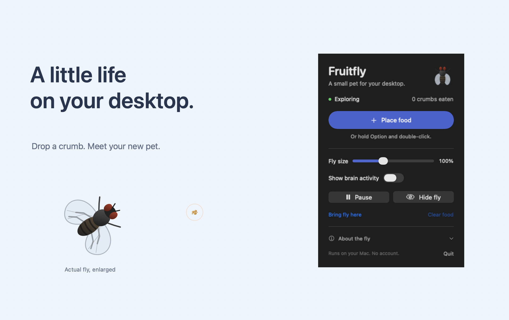

# Fruitfly

A small pet fly for your Mac desktop.

The fly moves above your apps. Drop food and watch it land and eat.
Move the pointer quickly near the fly to make it move away.



**[Download for Mac](https://github.com/onequbitaway/fruitfly/releases/latest)**

## Install

1. Open the download page.
2. Download the file that ends in `macos-universal.zip`.
3. Open the ZIP file.
4. Move Fruitfly to Applications.
5. Open Fruitfly.

The fly appears on your desktop. Click the fly icon in the menu bar for controls.

This early release does not yet have Apple approval through notarization.
If macOS blocks the app, open **System Settings → Privacy & Security**.
Use **Open Anyway** if you trust this download.
See [Apple's instructions](https://support.apple.com/en-us/102445) for more help.

## Requirements

- macOS 14 or later.
- An Apple Silicon or Intel Mac.

Windows and Linux are not supported.
The app runs without an account, Python, or a separate data download.

## Feed your fly

1. Click the fly icon in the menu bar.
2. Click **Place food**.
3. Click a location on your desktop.

Press Esc to cancel. Food placement also stops after 15 seconds.

You can also hold **Option** and double-click to drop food.
This shortcut also sends the click to the app below. Use **Place food** to capture one click instead.

Normal clicks pass through the fly to your other apps.

## Controls

| Control | Result |
| --- | --- |
| Place food | Select a location for a crumb. |
| Fly size | Make the fly smaller or larger. |
| Show brain activity | Show activity from selected cells beside the fly. |
| Pause / Resume | Stop or continue the fly and food. |
| Hide fly / Show fly | Hide or show the fly and its food. |
| Bring fly here | Move the fly to the center of the current screen. |
| Clear food | Remove all crumbs. |
| Quit | Close the app. |

The fly stays on one screen. Use **Bring fly here** to move it to another screen.
The app limits food to 12 crumbs. Uneaten crumbs expire after three minutes of active use.
The app stops while the screen sleeps. It uses slower movement when Reduce Motion is on.

## Build and start the app

1. Install the Apple build tools:

   ```sh
   xcode-select --install
   ```

2. Download the source:

   ```sh
   git clone https://github.com/onequbitaway/fruitfly.git
   cd fruitfly
   ```

3. Build and start the app:

   ```sh
   make run
   ```

The build creates `dist/Fruitfly.app`. You can move this file to Applications.
Run `make test` to check the movement and included data.
Run `make release` to build one app for both Mac types.

## Brain map

The app includes a small smell circuit from the [MaleCNS brain map](https://male-cns.janelia.org/).
It contains 3,745 cells and 435,997 connections.
The map records connections between nerve cells.

The model uses those connections to change the fly's speed and turns.
Food search, rest, eating, and pointer reactions use programmed rules.
This is a desktop pet with a small brain model. It is not a complete fly brain or a learning experiment.

Read [the data notes](docs/data.md) for the source, selection, and model limits.

## Privacy

The app uses the pointer position and mouse clicks for movement and food.
It does not read your screen, record keys, or send data to a server.
It saves only the fly size, the brain-view setting, and whether you opened it before.
It does not start when you log in.

The app does not request access to your files, camera, microphone, or screen.
The standard mouse shortcut uses a mouse event monitor. It does not require keyboard access.

## Contribute

Read [CONTRIBUTING.md](CONTRIBUTING.md) before you change the code.
See [docs/development.md](docs/development.md) for build and release steps.

## License

The app code uses the [MIT license](LICENSE).
Brain data retains its own license. See [docs/data.md](docs/data.md).
