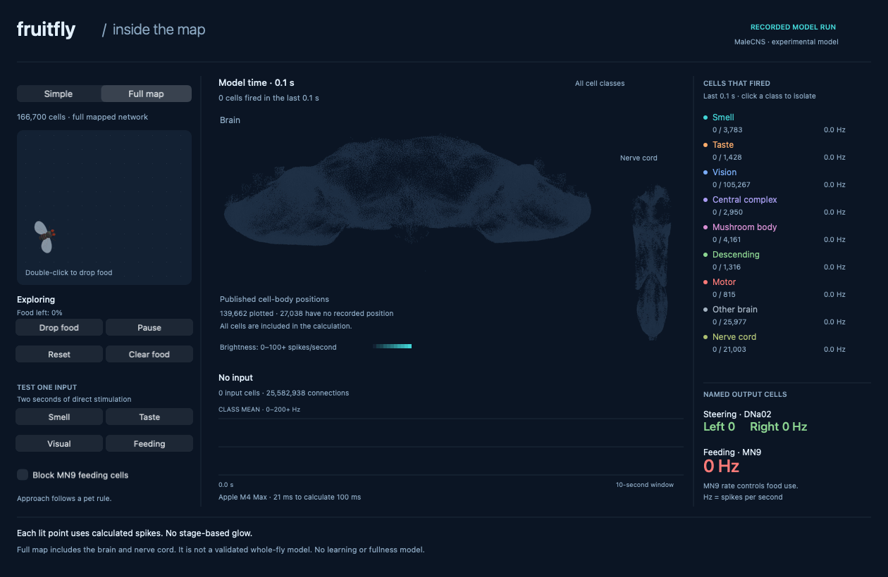
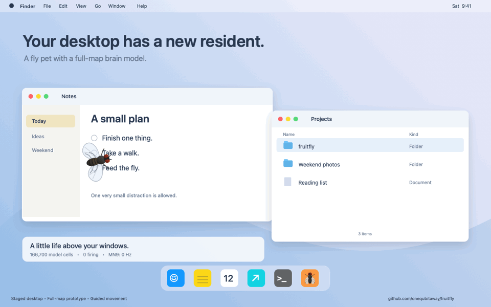

# Full map preview

The README shows a recording of an experimental model.
[Download the runnable preview](https://github.com/onequbitaway/fruitfly/releases/tag/full-map-preview-0.1.0)
or [build it from source](../experiments/full-map/README.md).
The preview window includes Simple and Full map modes. It is a separate app from the desktop pet.
The released app uses the smaller circuit shown in the **Simple** clip.
The two clips use different cell rules. They are not a controlled comparison of network size.

## What runs

The model uses 166,700 selected neurons from [MaleCNS v1.0](https://male-cns.janelia.org/download/).
It includes the brain and ventral nerve cord.
The selection keeps each non-glial annotation with a published superclass.
It keeps every positive connection between those cells, with no weight threshold or random sampling.
This gives 25,582,938 directed connections and 124,177,617 synaptic contacts.
Unclassified fragments are outside this selection.

Full map describes the selected network coverage.
The model does not include a complete working animal.
It has no learning, detailed sense organs, muscles, hormones, or fullness state.
The graph and cell IDs come from published data. The electrical rules and food signals are model choices.

## What the animation shows

The clip lasts eight seconds. It has 80 frames at ten frames per second.
Each frame uses the spikes from 100 milliseconds of model time.
The run starts with seed 7 and no input.
Food drops before frame 10, after one second of model time.
The first food response appears at model time 1.1 seconds.
The loop starts a new run from rest.

Food creates a chosen smell signal that falls with distance.
Contact adds a taste signal. This trial does not directly stimulate the feeding pathway.
The fly approaches food with a pet rule. The left-minus-right DNa02 output adds a small turn bias.
Food use reads the mean MN9 feeding-cell rate.
Its chosen rate is `min(1, MN9 Hz / 40)` times the pet's consumption rate.
This mapping is not a measured biological feeding threshold.

The fly has not finished the food when the clip ends.
The animation does not show a fullness response after eating.
No behavior label sets the brain brightness.

## Read the display

Each plotted point uses a published cell-body position.
The plot projects the X and Z coordinates. The brain and nerve cord use separate scales.
These positions do not show synapses or exact sites of neural processing.

139,662 cells have recorded positions. The other 27,038 cells remain in the calculation and class totals.
The view does not invent positions for them.
Colors show broad classes derived from the source annotations.
A class is not an exclusive label for a behavior such as navigation or eating.

A colored point means that cell fired during the last 100 milliseconds.
Brightness uses a fixed, quantized 0–100+ Hz scale. Hz means spikes per second.
Dark gray points show anatomy only.
The trace shows class means, including silent cells, on a fixed 0–200+ Hz scale.
The numeric readouts retain values above those display limits.

## Cell rules and inputs

The cell equations and parameters follow the leaky integrate-and-fire model in
[Shiu et al. (2024)](https://www.nature.com/articles/s41586-024-07763-9).
The [reference code](https://github.com/philshiu/Drosophila_brain_model) uses the female FlyWire graph.
This preview applies the equations to MaleCNS with different input handling.
It is not a validated reproduction of that paper or a real fly's behavior.

| Setting | Value |
| --- | --- |
| Rest and reset voltage | −52 mV |
| Firing threshold | Above −45 mV |
| Membrane time constant | 20 ms |
| Synaptic decay | 5 ms |
| Delay | 1.8 ms |
| Refractory period | 2.2 ms |
| Contact weight | 0.275 mV |
| Calculation step | 0.2 ms |

Predicted GABA and glutamate outputs are negative.
All other transmitter labels, including missing labels, are positive.
These uniform assumptions do not describe measured properties of every cell.
The solver uses the exact linear solution between spike events.
It sums simultaneous signed contact counts as integers before applying the weight.
It resets synaptic drive at a spike and rejects arrivals during the refractory period.
States below 0.000001 mV are set to rest. There is no background noise.
Selected inputs receive seeded random spikes with probability `rate × 0.0002` per step.
These forced spikes bypass refractory time.

| Signal in this food trial | Cells |
| --- | --- |
| Smell | 189 ORN_DM1, ORN_VA2, and ORN_DM4 cells |
| Contact taste | 57 gustatory LB1 cells |
| Steering readout | 2 DNa02 cells |
| Feeding readout | 2 MN9 cells |

The [odor literature](https://journals.plos.org/plosone/article?id=10.1371/journal.pone.0056361) informs the odor selection.
[Steering research](https://pmc.ncbi.nlm.nih.gov/articles/PMC12279373/) motivates the DNa02 readout.
These sources do not validate the chosen input rates or movement mapping.
Sugar specificity for the selected LB1 cells is not established here.

## Known limits

The model can spread activity across several classes.
In a separate one-second smell test, 4,160 of 4,161 mushroom-body cells fired in the final 100 milliseconds.
That broad response is not proof that a real fly responds this way.
It may reflect the uniform cell rules, chosen input, and transfer of parameters to a different graph.
We did not tune the display to create separate glowing regions for each behavior.

On the tested Apple M4 Max, input trials took about 0.4–0.5 seconds to calculate one second of model time.
That timing excludes drawing and first loading. Other Macs have not been measured.
A slower computer can run the model slower than real time.
The GIF is a recording, not a live calculation in the GitHub page.

## Check the saved values

- [Still from the food trial](media/full-map-activity.png).
- [Frame times, inputs, class means, outputs, and food state](media/full-map-frames.json).
- [All cell spike rates](media/full-map-cell-activity.f32.gz), compressed with gzip.
- [Cell IDs, class assignments, sides, and input/output indices](media/full-map-cell-index.json.gz), compressed with gzip.
- [Recording settings, data selection, source hashes, file hashes, and check results](media/full-map-manifest.json).

The rate file has 13,336,000 values: 80 frames × 166,700 cells.
Each is a little-endian 32-bit float in spikes per second.
Values are stored by frame, then by cell. Cell order matches `ids` in the cell index file.
The index arrays under `channels` point into that same cell order.
All saved values were checked against the frame counts, class means, and MN9 readouts.

The local model checks covered an independent inhibitory response, delay, sign, isolated pathways, repeatability, and absence of input.
CPU and graphics calculations produced the same cell rates and total spike counts in a 300-millisecond full-network comparison.
Blocking MN9 prevented food use while other cells still fired.
These checks test the software. They do not establish biological accuracy.
The [full-map source](../experiments/full-map) includes both solvers, the controls, and the animation code.
The preview release contains the prepared data pack and a Mac app with both modes.
Run `make preview-test` to check the model. Run `make preview-demo` to render a new brain recording.
Run `make desktop-demo` to render the desktop GIF and MP4 videos.
The [source guide](../experiments/full-map/README.md) explains setup and saved-value checks.
`make check-demo` continues to check the released Simple clip only.

## Desktop video

The [desktop video](https://github.com/onequbitaway/fruitfly/releases/download/full-map-preview-0.1.0/fruitfly-desktop-full-map.mp4)
shows a 12-second trial. The windows and pointer are drawn for the scene.
It is not a recording of a personal desktop or a demonstration of a new desktop overlay.
The full-map app runs in its own window.

The trial uses a 0.1 portion. Actual MN9 output consumes it by 6.4 seconds of model time.
The fly then resumes the prototype's exploring motion.
The [frame trace](media/desktop-full-map-frames.json) records the inputs, readouts, and trial states.
The release's evidence archive includes all 20,004,000 cell rates and the checks.

The [20-second cut](https://github.com/onequbitaway/fruitfly/releases/download/full-map-preview-0.1.0/fruitfly-desktop-and-brain.mp4)
puts this desktop trial before the earlier eight-second brain recording.
These are separate runs. The model clock starts again at the cut.

## Source and license

MaleCNS v1.0 is from HHMI Janelia FlyEM, University of Cambridge,
MRC Laboratory of Molecular Biology, and Google Research.
The data retains [CC BY 4.0](https://creativecommons.org/licenses/by/4.0/).
The preview changes the file format, assigns display classes, and selects input cells.
Attribution does not imply endorsement.
